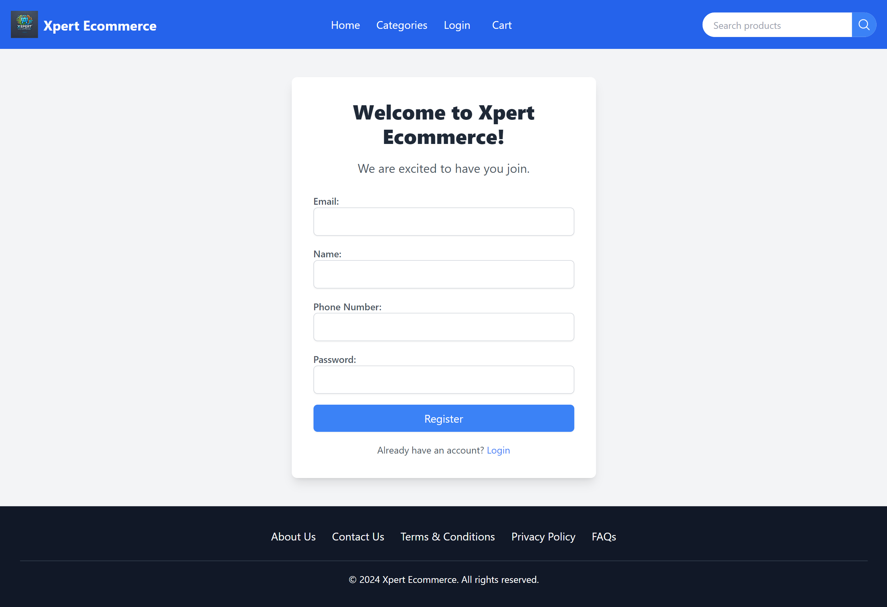

# Xpert Ecommerce

Xpert Ecommerce is a full-stack e-commerce platform built with Java Spring Boot for the backend, ReactJS for the frontend, and MySQL as the database. It utilizes Amazon S3 for image storage, ensuring secure and scalable storage.

## Features

- **User Authentication:** Secure login and registration.
- **Product Browsing:** Explore a variety of products with search and filter options.
- **Shopping Cart:** Add, update, and remove items in your shopping cart.
--**Admin Module:** Manage Store.
- **Responsive Design:** User-friendly interface across all devices.

## Technologies Used

- **Backend:** Java Spring Boot
- **Frontend:** ReactJS
- **Database:** MySQL
- **Storage:** Amazon S3

## Screenshots

### • USER

### Login Page


### Register Page


### Home Page


### Category Page


### Account Profile


## Installation

1. Clone the repository:
   ```bash
   git clone https://github.com/manishsahanidev/Xpert-Ecommerce.git
